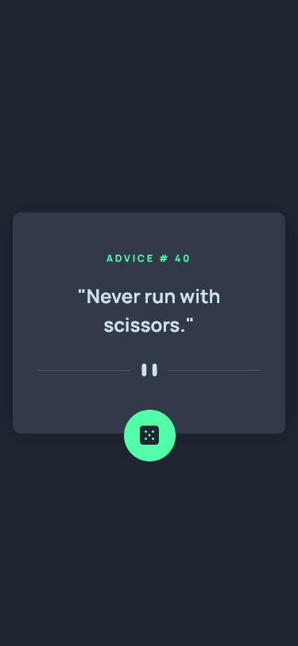
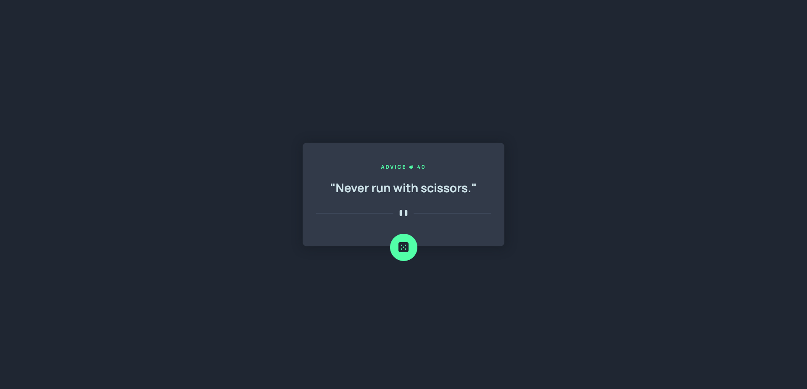

# Frontend Mentor - Advice generator app solution

This is a solution to the [Advice generator app challenge on Frontend Mentor](https://www.frontendmentor.io/challenges/advice-generator-app-QdUG-13db). Frontend Mentor challenges help you improve your coding skills by building realistic projects.

## Table of contents

- [Overview](#overview)
  - [The challenge](#the-challenge)
  - [Screenshot](#screenshot)
  - [Links](#links)
- [My process](#my-process)
  - [Built with](#built-with)
  - [What I learned](#what-i-learned)
  - [Continued development](#continued-development)
  - [Useful resources](#useful-resources)
- [Author](#author)

## Overview

### The challenge

Users should be able to:

- Generate new advice by clicking on the button

### Screenshot

### Links

- [Live site URL](https://advice-generator-kas.netlify.app/)

## My process

### Built with

- Semantic HTML5 markup
- CSS custom properties
- CSS Grid
- CSS keyframes
- Mobile-first workflow
- [Advice Slip JSON API](https://api.adviceslip.com/#object-slip)

### What I learned

This challenge was a speedrun for me to test how quickly I could solve it (it was surprisingly quick, both CSS and JS part). I didn't learn anything new from it, although practicing fetch is always useful!

## Author

- Frontend Mentor - [@FluffyKas](https://www.frontendmentor.io/profile/FluffyKas)
- Twitter - [@fluffykas](https://www.twitter.com/FluffyKas)
